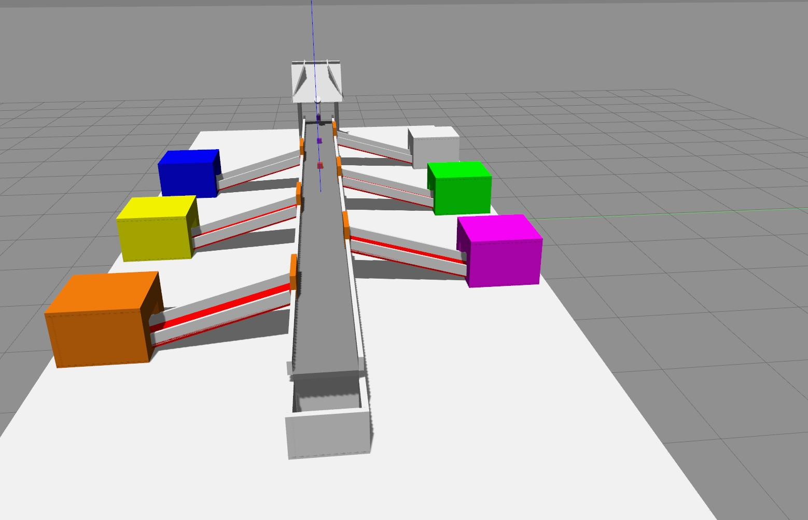
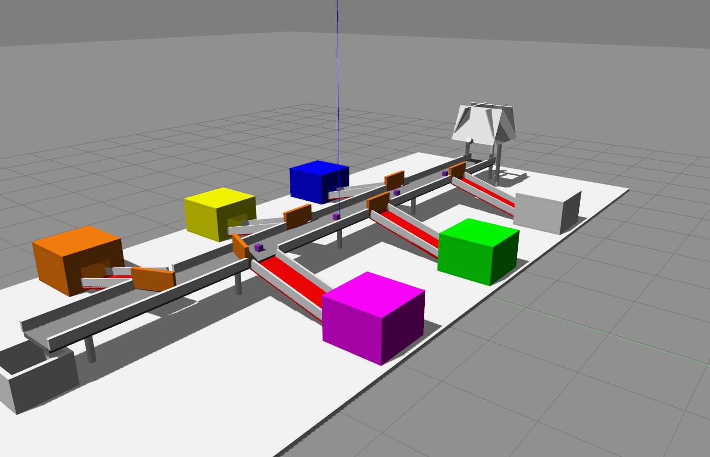
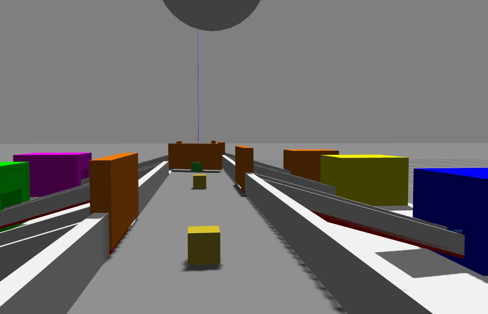
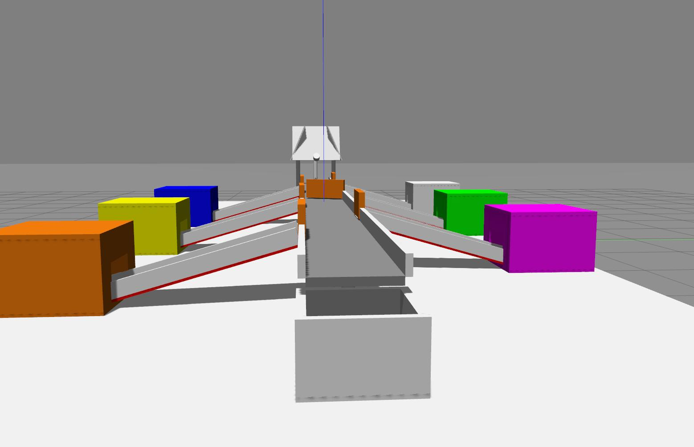
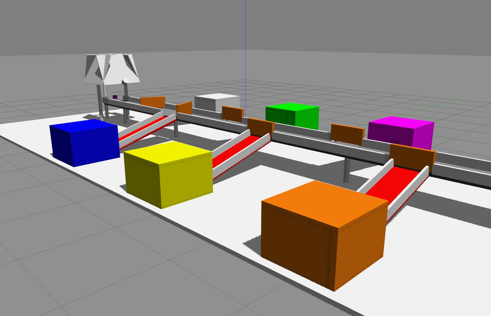
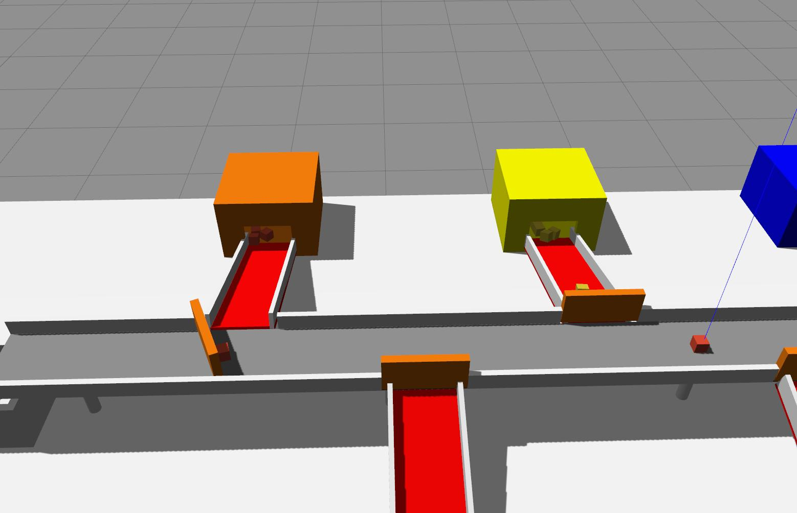
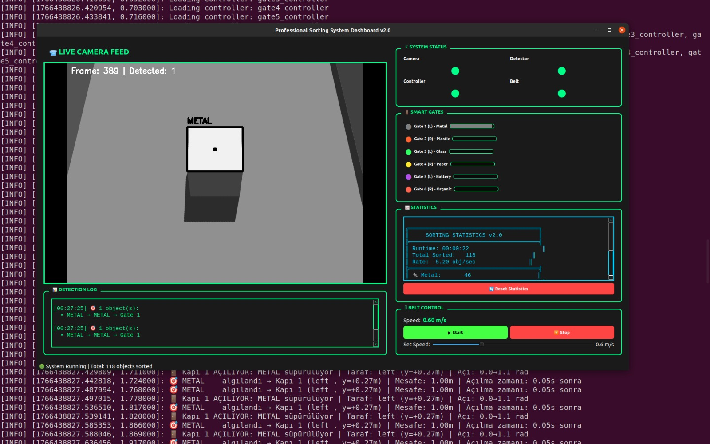
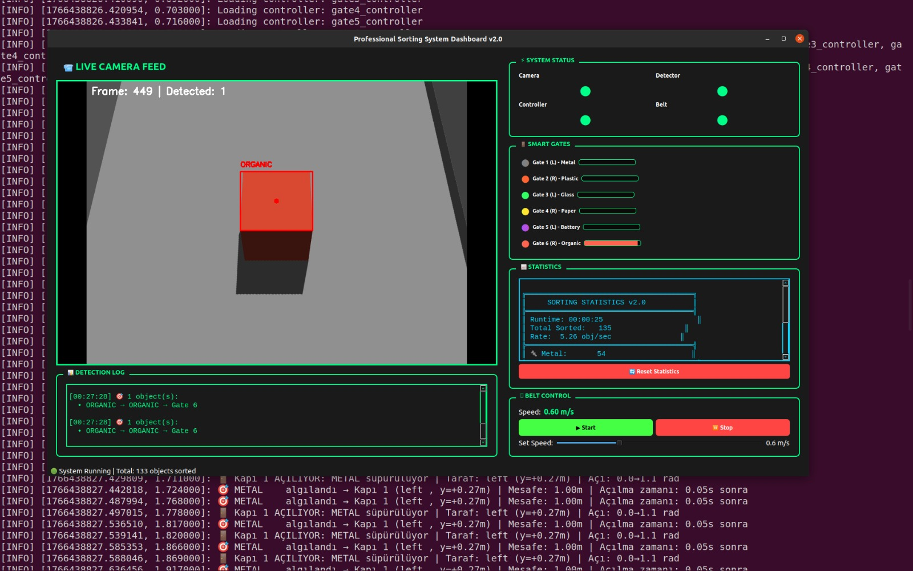

# Autonomous Waste Sorting System (v2.0)

[](https://www.ros.org/)
[](https://gazebosim.org/)
[](LICENSE)

**Virtual validation & digital twin** for an autonomous, vision-based waste sorting line — Metal, Plastic, Glass, Paper, Battery, Organic.

---

## Table of Contents

- [Overview](#overview)
- [Problem & Solution](#problem--solution)
- [Architecture & Technologies](#architecture--technologies)
- [Technical Components](#technical-components)
- [Gallery](#gallery)
- [Installation](#installation)
- [Usage](#usage)
- [Performance](#performance)
- [Project Structure](#project-structure)
- [Contributing & License](#contributing--license)

---

## Overview

This project is an **autonomous sorting system** running on the **Gazebo** physics engine, designed to increase efficiency in waste management and reduce risks (e.g. battery leakage and fire) through **virtual validation** and a full **digital twin** of the physical process. Six waste categories are sorted without human intervention using **computer vision** and **PID-controlled sweeper gates**.

---

## Problem & Solution

| Aspect | Description |
|--------|-------------|
| **Industrial need** | Manual sorting of lithium-ion batteries and mixed waste in recycling plants is slow, costly, and carries fire and toxicity risks. |
| **Approach** | Image processing and robotic control sort **6 waste types** (Metal, Plastic, Glass, Paper, Battery, Organic) at high throughput and safely. |
| **Digital twin** | A complete software replica of the system allows design and tuning without hardware, and scales at low cost. |

---

## Architecture & Technologies

The stack uses a **hybrid C++ / Python** architecture: **C++** for Gazebo plugins (physics, belt, spawners) and **Python** for ROS nodes (vision, control, dashboard).

| Layer | Technology |
|-------|------------|
| **Simulation** | Gazebo 11 |
| **Middleware** | ROS (Robot Operating System) |
| **Vision** | OpenCV & HSV-based color analysis |
| **Control** | PID controllers (*P* = 50.0) and **Sweeper Gate** mechanism |
| **UI** | PyQt5 real-time system dashboard |

---

## Technical Components

| Node / Plugin | Role |
|---------------|------|
| **`/color_detector`** | Consumes camera images, runs HSV analysis, and publishes object class. |
| **`/sorter_controller`** | Computes gate trigger time *T*<sub>trigger</sub> from object speed and distance (millisecond accuracy). |
| **`conveyor_mover`** (C++ plugin) | Drives belt physics and object motion. |
| **`/system_dashboard`** | Live telemetry, statistics, and manual belt/gate control for operators. |

---

## Gallery

### System Layout & Simulation Views
The simulation features a 9-meter conveyor belt with 6 distinct sorting stations.

| | | |
|:---:|:---:|:---:|
|  |  |  |
| **Station 1 & 2** | **Full Line View** | **Conveyor Perspective** |
|  |  |  |
| **Sorting Logic** | **Side View** | **Top/Rear View** |

### Computer Vision & Dashboard
| | |
|:---:|:---:|
|  |  |
| **Live Object Detection** | **Dashboard Interface** |

---

## Installation

### 1. System requirements

- **Ubuntu** 20.04 LTS (or compatible)
- **ROS** Noetic or Melodic (desktop-full recommended)
- **Gazebo** 11

### 2. Workspace setup

```bash
mkdir -p ~/catkin_ws/src
cd ~/catkin_ws/src
git clone https://github.com/fuatsimsek/Autonomous-Waste-Sorting-System.git
```

### 3. Dependencies

```bash
sudo apt-get update
sudo apt-get install -y \
  ros-noetic-gazebo-ros-control \
  ros-noetic-effort-controllers \
  ros-noetic-joint-state-controller
```

### 4. Build & source

```bash
cd ~/catkin_ws
catkin_make
source devel/setup.bash
```

---

## Usage

Launch the full stack (Gazebo world + ROS control + optional dashboard):

```bash
roslaunch pil_ayiklama_sim sorting.launch
```

Optional: run the gate test script in another terminal:

```bash
rosrun pil_ayiklama_sim test_gates.py
```

---

## Performance

Simulation results at **0.6 m/s** belt speed:

| Metric | Result |
|--------|--------|
| **Battery** (project focus) | 100% sorting success |
| **Metal** | 100% sorting success |
| **Overall detection** | ~96% success rate |

---

## Project Structure

```
Autonomous-Waste-Sorting-System/
├── assets/             # Screenshots: stand_1..6, camera_view_1..2
├── config/             # Controllers, RViz
├── launch/             # sorting.launch
├── scripts/            # Python nodes (detector, controller, dashboard, tests)
├── src/                # C++ Gazebo plugins (conveyor, spawner, etc.)
├── urdf/               # main_station.xacro
├── worlds/             # sorting_world.sdf
├── CMakeLists.txt      # Build configuration
├── package.xml         # Package dependencies
└── README.md           # Documentation
```

---

## Contributing & License

Contributions are welcome. This project is under the **MIT** license.

---

*Autonomous Waste Sorting System v2.0 — Digital twin & virtual validation on Gazebo + ROS.*
